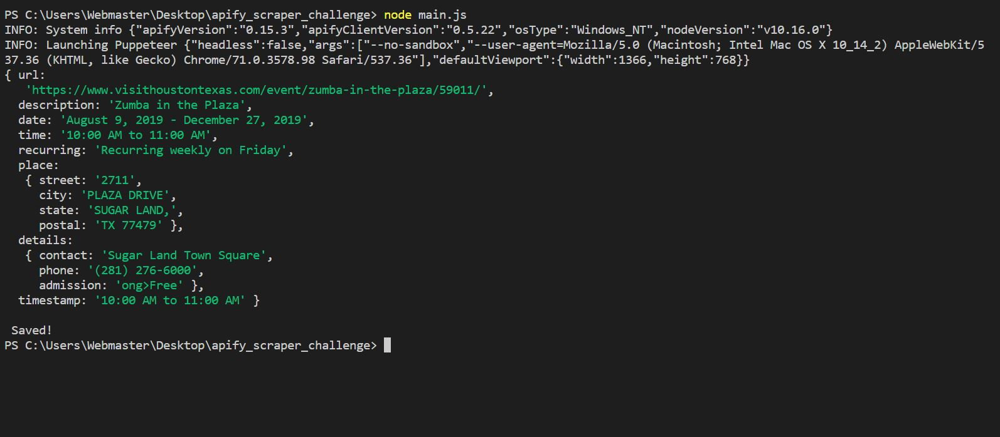

# apify_web_scraper

WEB SCRAPING WITH NODE JS

Instructions
1 - Once downloaded run npm i
2 - Then simply run 'node main.js' in terminal

Expected Console Output:

{ url:
   'https://www.visithoustontexas.com/event/zumba-in-the-plaza/59011/',
  description: 'Zumba in the Plaza',
  date: 'August 2, 2019 - December 27, 2019',
  time: '10:00 AM to 11:00 AM',
  recurring: 'Recurring weekly on Friday',
  place:
   { street: '2711',
     city: 'PLAZA DRIVE',
     state: 'SUGAR LAND,',
     postal: 'TX 77479' },
  details:
   { contact: 'Sugar Land Town Square',
     phone: '(281) 276-6000',
     admission: 'ong>Free' },
  timestamp: '10:00 AM to 11:00 AM' }

Saved!

Operation
Scraping the html data from https://www.visithoustontexas.com/event/zumba-in-the-plaza/59011/ 
Saving that data to a text file and outputing that data to the console
The data consist of:
Event name
Event date and time
Event recurrence
Event address
Event details
Event description
Event source url
Event organizer's info

Technology

Node.js 
Apify
Puppeteer

